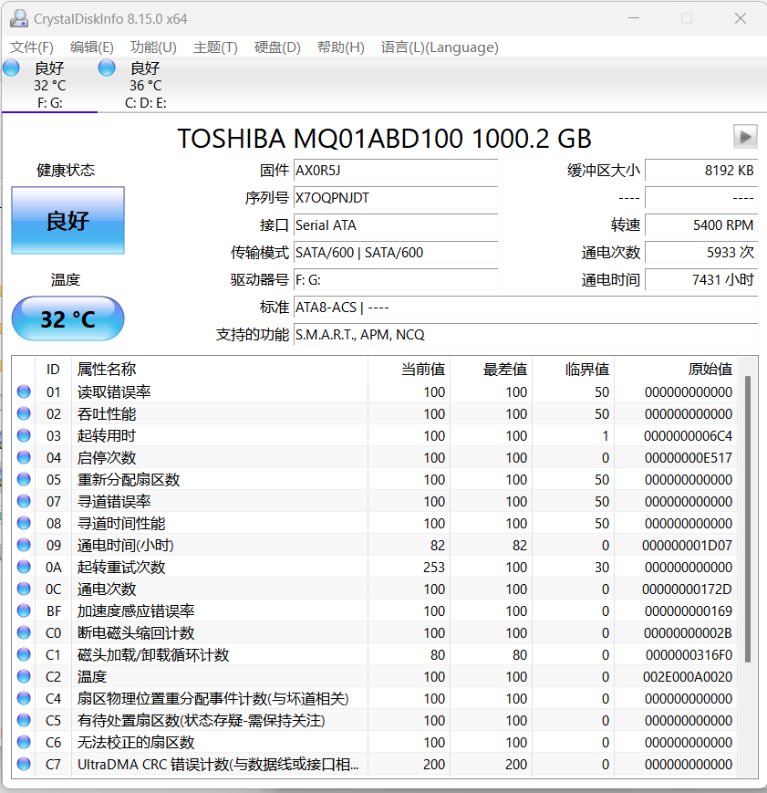
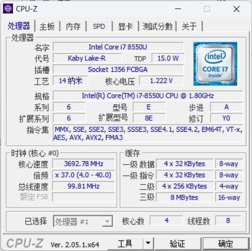
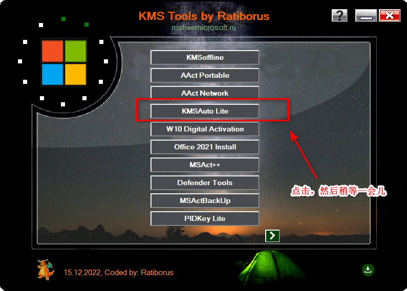

# Common

## Notepad++

记事本

官网地址：[Notepad++ (notepad-plus-plus.org) https://notepad-plus-plus.org/](https://notepad-plus-plus.org/)

8.5.2版本地址：[点击下载](file/npp.8.5.2.Installer.x64.exe)，蓝奏下载：https://huoxinwl.lanzoup.com/ip77g0xmx9dg

## SpaceSniffer

磁盘分析软件

官网地址：[SpaceSniffer download (uderzo.it)  http://www.uderzo.it/main_products/space_sniffer/download.html](http://www.uderzo.it/main_products/space_sniffer/download.html)

1.3.0.2版本地址：[点击直接下载](file/SpaceSniffer.exe)，蓝奏下载：https://huoxinwl.lanzoup.com/iVdZ10xmx9tc

## Geek

卸载工具

官网地址：[Geek Uninstaller - Download https://geekuninstaller.com/download](https://geekuninstaller.com/download)

1.4.8.145版本地址：[点击下载](file/geek.exe)，蓝奏下载：https://huoxinwl.lanzouy.com/iouY60xmxbgb

## Everything

官网地址：[下载 - voidtools  https://www.voidtools.com/zh-cn/downloads/](https://www.voidtools.com/zh-cn/downloads/)

## 百度网盘破解版

下载链接:https://wwk.lanzoue.com/b01c3aebc   密码:8888

密钥下载：[点击下载](file/百度网盘密钥.7z)，蓝奏下载：https://huoxinwl.lanzoup.com/i4gEf0xmxtve

## Typora

官网安装包地址：[Typora — a markdown editor, markdown reader.   https://download.typora.io/windows/typora-setup-x64-1.5.12.exe](https://download.typora.io/windows/typora-setup-x64-1.5.12.exe)

破解文件winmm.dll：[点击直接下载](file/typora_x64_Patch.zip)，蓝奏下载：https://huoxinwl.lanzoup.com/iPBkF0xmw1ba

直接安装官网安装包，关闭Typora软件，将winmm.dll放置于Typora安装目录下即可。

## Clash

Github官网：[GitHub - Fndroid/clash_for_windows_pkg: A Windows/macOS GUI based on Clash](https://github.com/Fndroid/clash_for_windows_pkg)

0.20.32版本蓝奏下载：https://huoxinwl.lanzouy.com/iAOfq16xi1ej

# Other

## FSCapture

截图工具

官网地址：[FastStone Capture中文版下载安装_兼容Windows 11/10/8/7/Vista_FastStone Capture中文网官网](https://www.faststonecapture.cn/download)

10.2版本：[点击直接下载](file/FSCaptureSetup.exe)，蓝奏下载：https://huoxinwl.lanzouy.com/iOlMj14mz0jc

name：bluman

serial/序列号/注册码：VPISCJULXUFGDDXYAUYF

## ImgToPdf

图片转PDF工具

官网地址：[CompulsiveCode - Image to PDF Converter  http://www.compulsivecode.com/Project_ImageToPDF.aspx](http://www.compulsivecode.com/Project_ImageToPDF.aspx)

5.1版本：[点击直接下载](file/ImageToPDForXPS5.1.exe)，蓝奏下载：https://huoxinwl.lanzoup.com/izcGo0xmw3bc

4.2版本：[点击直接下载](file/ImageToPDForXPS4.2.exe)，蓝奏下载：https://huoxinwl.lanzoup.com/iXwt80xmw3cd

## DiskGenius

磁盘分区工具

官网地址：[DiskGenius – 正式版下载|免费下载 https://www.diskgenius.cn/download.php](https://www.diskgenius.cn/download.php)

## CrystalDisk

硬盘检测工具

官网地址：[Download - Crystal Dew World crystalmark.info  http://crystalmark.info/en/download/](http://crystalmark.info/en/download/)

8.17.14版本：[点击直接下载](file/CrystalDiskInfo8_17_14.zip)，蓝奏下载：https://huoxinwl.lanzoup.com/icnok0xmw64d

## CPU-Z

硬件检测工具

官网地址：[CPU-Z | Softwares | CPUID  https://www.cpuid.com/softwares/cpu-z.html](https://www.cpuid.com/softwares/cpu-z.html)

2.5.1x32版本：[点击直接下载](file/cpuz_x32.exe)，蓝奏下载：https://huoxinwl.lanzoup.com/ipdfo0xmw92j
2.5.1x64版本：[点击直接下载](file/cpuz_x64.exe)，蓝奏下载：https://huoxinwl.lanzoup.com/i8ZOg0xmw9kh

## StarUML

UML绘图工具

4.1.6破解版本，安装官网软件，进入根目录，替换resource中的app.asar。不同版本替换的asar不一样。

破解教程 [StarUml下载，安装和授权破解教程 - 知乎 (zhihu.com)  https://zhuanlan.zhihu.com/p/570249470](https://zhuanlan.zhihu.com/p/570249470)

百度网盘:  https://pan.baidu.com/s/17Ytgb1cKJ17PLXOnXDr02w?pwd=hxwl 提取码: hxwl

# System

## Windows 11/10

**推荐第三方纯净系统**：https://next.itellyou.cn/

**微软官方**：[Download Windows 11 (microsoft.com)](https://www.microsoft.com/zh-cn/software-download/windows11)

​					[Download Windows 10 (microsoft.com)](https://www.microsoft.com/zh-cn/software-download/windows10)

## KMS激活工具

**KMSTools**

15.12 2022版本

官网：[MSFree Soft - Главная страница (msfreemicrosoft.ru)](https://msfreemicrosoft.ru/)

蓝奏下载：https://huoxinwl.lanzouy.com/iwjhZ16xdq4j

**HEU_KMS_Activator_v30.3.0**

Github：[GitHub - zbezj/HEU_KMS_Activator https://github.com/zbezj/HEU_KMS_Activator](https://github.com/zbezj/HEU_KMS_Activator)

蓝奏下载：https://huoxinwl.lanzouy.com/ikPtC16xdkva

